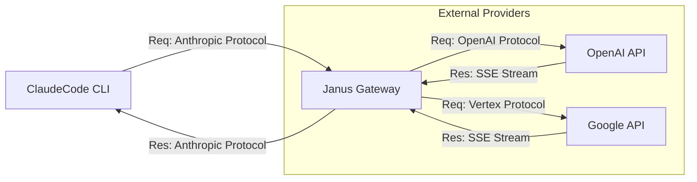

# Janus (Claude Subscription Gateway)

ClaudeCode CLI (`claude`) が、Anthropic APIの代わりに OpenAI (Codex) や Google (Antigravity/Gemini) のサブスクリプションを利用できるようにするローカルプロキシゲートウェイです。

## 概要

**Janus** は、中間者（Man-in-the-Middle）として動作するローカルサーバーを提供します。ClaudeCodeからのAnthropic API形式のリクエストを傍受し、認証情報の注入とプロトコル変換を行った上で、以下のバックエンドサービスへ転送します。

* **OpenAI**: ChatGPT Plus/Pro/Team サブスクリプション (Codex CLI互換)
* **Google**: Gemini Advanced / Google One AI Premium (Antigravity/Cloud Code互換)

これにより、API従量課金ではなく、既存の定額サブスクリプション権限でClaudeCodeを活用することが可能になります。

## 機能

* **プロトコル変換**: Anthropic Messages APIのリクエスト/レスポンスをOpenAI/Gemini形式に相互変換
* **ストリーミング対応**: Server-Sent Events (SSE) によるリアルタイムレスポンス変換により、スムーズな表示を実現
* **認証マネージャー**: CLI向けのOAuthフロー（Device Flow / Loopback）を模倣し、トークンを安全に管理
* **モデル一覧提供 (`/models`)**: ClaudeCodeが起動時に問い合わせるモデル一覧エンドポイントを提供し、利用可能なバックエンドモデルを動的に通知
* **モデルルーティングとパススルー**: エイリアスによる自動マッピングに加え、バックエンドのモデルIDを直接指定するパススルーリクエストに対応

## 対応モデルとマッピング

ClaudeCodeから指定されたモデルは、以下のようにバックエンドのモデルへ自動的にマッピングされます。

| ClaudeCode指定モデル (Alias) | OpenAI (Codex) | Google (Antigravity) |
| :--- | :--- | :--- |
| `claude-3-5-sonnet-20241022` | `gpt-4o` | `gemini-1.5-pro` |
| `claude-3-opus-20240229` | `gpt-4o` | `gemini-1.5-pro` |
| `claude-3-sonnet-20240229` | `gpt-4o` | `gemini-1.5-pro` |
| `claude-3-haiku-20240307` | `gpt-4o-mini` | `gemini-2.0-flash-exp` |

### パススルー機能

マッピング表にないモデル名が指定された場合、ゲートウェイは以下のルールでバックエンドへリクエストをパススルー（そのまま転送）します。

1. **OpenAI**: `gpt-`, `o1-`〜`o9-`, `chatgpt-` で始まるモデル名、または `codex` を含むモデル名は、そのままOpenAIへ転送されます。
2. **Google**: `gemini-` で始まるモデル名、または `antigravity` を含むモデル名は、そのままGoogleへ転送されます。
3. **Anthropic (上記以外)**: 上記のいずれにも該当しないモデル名は、**Anthropic APIへ直接転送（パススルー）**されます。
    * **重要**: Anthropicへのパススルーを利用する場合、有効な `x-api-key` ヘッダーが必要です。ダミーのキーでは認証エラーとなります。

これにより、新しく追加されたモデルやExperimentalなモデルも即座に利用可能です。

## インストールとセットアップ

### 前提条件

* Node.js (v18以上)
* OpenAI または Google の有効なサブスクリプションアカウント

### インストール

```bash
git clone [https://github.com/yohi/janus.git](https://github.com/yohi/janus.git)
cd janus
npm install
npm run build

```

## 使い方

### 1. ゲートウェイの起動

サーバーを起動してバックグラウンドで待機させます。

```bash
npm start
# または開発モード（ホットリロード有効）
npm run dev

```

デフォルトでは `http://localhost:4000` で起動します。

### 2. 認証 (初回のみ)

利用したいプロバイダーの認証を行います。ブラウザが起動し、ログインを求められます。

**OpenAI (Codex) の認証:**

```bash
npm run auth:codex

```

**Google (Antigravity) の認証:**

```bash
npm run auth:antigravity

```

現在の認証ステータスは以下のコマンドで確認できます。

```bash
npm run status

```

### 3. ClaudeCodeの設定

ClaudeCodeがローカルゲートウェイを経由するように環境変数を設定します。
(`.bashrc` や `.zshrc` に追加することを推奨します)

```bash
# ゲートウェイのアドレス
export ANTHROPIC_BASE_URL="http://localhost:4000"

# 重要: Anthropicパススルーを使用する場合は有効なAPIキーを設定してください。
# OpenAI/Google変換のみを使用する場合でも、クライアントの要件を満たすために
# 何らかの値を設定する必要があります（例: ダミーキー）。
export ANTHROPIC_API_KEY="sk-ant-api03-..."
# または
export ANTHROPIC_API_KEY="dummy-key-for-gateway"

```

### 4. ClaudeCodeの実行

ゲートウェイ経由でモデルを指定して実行します。

```bash
# GPT-4o を使用する場合
claude --model gpt-4o

# Gemini 1.5 Pro を使用する場合
claude --model gemini-1.5-pro

# Gemini 2.0 Flash (Experimental) を使用する場合
claude --model gemini-2.0-flash-exp

```

## 開発

* **ビルド**: `npm run build`
* **テスト**: `npm test`
* **開発サーバー**: `npm run dev`

## アーキテクチャ

本ゲートウェイはClaudeCodeが期待するAnthropic APIの挙動を完全にエミュレートします。

1. **`/models` エンドポイント**: 起動時に利用可能なモデルID（`gpt-4o`, `gemini-1.5-pro` 等）と、Claudeのエイリアスを返却します。
2. **`/messages` エンドポイント**: チャット補完リクエストを受け取り、指定されたモデルに応じてバックエンドAPI（OpenAI/Vertex）へプロトコル変換して転送します。



## 免責事項

本ツールは非公式の実験的プロジェクトです。各サービスプロバイダーの利用規約を遵守してご使用ください。意図しない利用方法によるアカウントの制限等について、開発者は責任を負いません。
