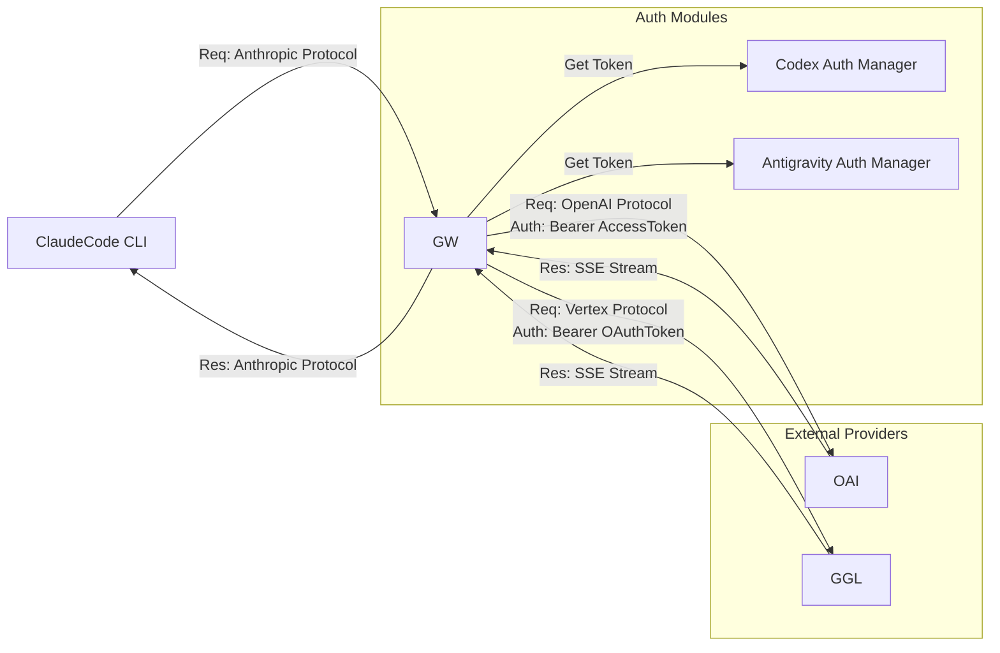

# ClaudeCode 拡張プラグイン設計書：Subscription Gateway (CSG)

## 1. プロジェクト概要

### 1.1 目的

ClaudeCode CLI (`claude`) のバックエンドとして、Anthropic APIの代わりに以下のサブスクリプション権限を利用可能にするローカルプロキシ（ミドルウェア）を構築する。

* **OpenAI:** ChatGPT Plus/Pro/Team サブスクリプション（Codex CLI認証フローを再現）
* **Google:** Gemini Advanced / Google One AI Premium（Antigravity/Cloud Code認証フローを再現）

### 1.2 アーキテクチャ：The "Man-in-the-Middle" Gateway

ClaudeCodeは環境変数 `ANTHROPIC_BASE_URL` を変更することで接続先を切り替えられます。本プラグインは、ローカルホスト（例: `http://localhost:3000`）で待ち受け、ClaudeCodeからのリクエストを傍受し、**プロトコル変換**と**サブスクリプション認証情報の注入**を行った上で、各社の非公開（Internal/Grey）APIへ転送します。



---

## 2. 機能要件と仕様

### 2.1 認証マネージャー (Auth Manager)

通常のAPIキーではなく、CLIツール向けのOAuthフローを模倣します。

#### A. OpenAI (Codex) 認証モジュール

* **認証方式:** OAuth 2.0 Device Authorization Grant (RFC 8628)
* **クライアントID:** OpenAI Codex CLIが使用している公開クライアントIDを利用（またはユーザーに抽出させる）。
* **トークン管理:**
* `access_token` と `refresh_token` を取得。
* `~/.codex_proxy/auth.json` に暗号化して保存。
* リクエスト毎に有効期限を確認し、期限切れならリフレッシュトークンで自動更新するロジックを実装。


* **ターゲットAPI:** `https://api.openai.com/v1` (ただし、ヘッダーに `OpenAI-Beta: codex-cli` 等の特殊ヘッダーが必要な場合あり)

#### B. Google (Antigravity) 認証モジュール

* **認証方式:** Google OAuth 2.0 (Local Server Receiver / Loopback IP)
* **必須スコープ:** `https://www.googleapis.com/auth/daily-cloudcode-pa` (Antigravity/Geminiへのアクセス権を持つ内部スコープ) および `cloud-platform`。
* **トークン管理:**
* `gcloud` CLIや`opencode-antigravity-auth`と互換性のある形式、または独自に `~/.antigravity_proxy/credentials.json` に保存。
* Gemini Advanced契約があるアカウントでのログインを必須とする。


* **ターゲットAPI:** `daily-cloudcode-pa.googleapis.com` 上の `streamGenerateContent` エンドポイント。

### 2.2 プロトコル変換 (Protocol Transpiler)

ClaudeCodeは **Anthropic Messages API** 形式でリクエストを送ってきます。これをリアルタイムで変換する必要があります。

| 項目 | 入力 (Anthropic) | 出力 (OpenAI Codex) | 出力 (Google Antigravity) |
| --- | --- | --- | --- |
| **System Prompt** | `system` (top-level) | `messages` (role: system) | `systemInstruction` |
| **User Message** | `content` (text/image) | `content` (text/image_url) | `parts` (text/inlineData) |
| **Tools (Function)** | `tools` (Anthropic Schema) | `tools` (OpenAI Schema) | `tools` (Gemini Schema) |
| **Response** | SSE (`message_start`, etc.) | SSE (`chunk.choices`) | SSE (`streamGenerateContent`) |

**特に重要な要件:**

* **ストリーミング変換:** レスポンスはすべてServer-Sent Events (SSE)で返されます。各社のチャンク形式（OpenAIのdelta、Googleのcandidates）を、Anthropicの `content_block_delta` イベントに**遅延なく**変換して流す必要があります。これを行わないと、ClaudeCodeのターミナル表示がカクつく、またはタイムアウトします。

---

## 3. 実装・作業手順書 (SOP)

Node.js (TypeScript) を使用して、このゲートウェイを作成する手順です。

### フェーズ1: プロジェクトセットアップ

1. **プロジェクト初期化**
```bash
mkdir claude-subscription-gateway
cd claude-subscription-gateway
npm init -y
npm install express cors axios dotenv keytar open
npm install -D typescript @types/node @types/express nodemon
npx tsc --init

```


* `keytar`: システムのキーチェーンにトークンを安全に保存するために推奨（Linuxの場合は`libsecret`依存に注意）。
* `open`: ブラウザでの認証フロー起動用。


2. **サーバーの基本骨格 (`src/index.ts`)**
```typescript
import express from 'express';
import { handleMessages } from './routes/messages';

const app = express();
app.use(express.json({ limit: '50mb' })); // 大きなファイルコンテキストに対応

// Anthropic API互換エンドポイント
app.post('/v1/messages', handleMessages);

const PORT = 4000;
app.listen(PORT, () => console.log(`Gateway running on port ${PORT}`));

```


### フェーズ2: 認証モジュールの実装

#### 3. OpenAI Device Flowの実装 (`src/auth/openai.ts`)

```typescript
// 概念コード
export async function loginCodex() {
  // 1. Device Codeのリクエスト
  const res = await axios.post('https://auth0.openai.com/oauth/device/code', {
    client_id: 'YOUR_CODEX_CLIENT_ID', // リバースエンジニアリングで特定が必要
    scope: 'openid profile email offline_access model.request'
  });
  
  console.log(`Open this URL: ${res.data.verification_uri_complete}`);
  
  // 2. ポーリングしてトークン取得
  const token = await pollForToken(res.data.device_code, res.data.interval);
  await saveToken(token);
}

export async function getValidCodexToken() {
  // 保存されたトークンを読み込み、期限切れならrefresh_tokenで更新して返す
}

```

#### 4. Google OAuthの実装 (`src/auth/google.ts`)

Googleの認証には `google-auth-library` を使うのが手っ取り早いですが、カスタムスコープ（Antigravity）を通すために手動構築が必要な場合があります。

```typescript
// 概念コード
const SCOPES = ['https://www.googleapis.com/auth/daily-cloudcode-pa', 'email'];

export async function loginAntigravity() {
  // ローカルサーバーを立ててブラウザを開き、OAuthコールバックを受け取る標準的なフロー
  // 取得したRefresh Tokenを保存
}

```

### フェーズ3: プロトコル変換ロジックの実装 (`src/transpilers/`)

ここが最も複雑です。既存のライブラリ（`langchain`など）はオーバーヘッドが大きいため、軽量な変換関数を書くことを推奨します。

1. **Request Transpiler:**
ClaudeCodeからのJSONを受け取り、ターゲット（Codex/Gemini）のJSONに変換する。特に `tools` 定義の変換は正確に行う必要があります（OpenAIとAnthropicは構造が似ていますが、Geminiは異なります）。
2. **Response Transpiler (Streaming):**
Axios等で外部APIを `responseType: 'stream'` で叩き、データが来るたびにパースして、Anthropic形式のイベント文字列に書き換えて `res.write()` します。
```typescript
// 例: OpenAI -> Anthropic
stream.on('data', (chunk) => {
  const openaiData = parseOpenAIChunk(chunk);
  if (openaiData.content) {
    const anthropicEvent = {
      type: "content_block_delta",
      index: 0,
      delta: { type: "text_delta", text: openaiData.content }
    };
    res.write(`event: content_block_delta\ndata: ${JSON.stringify(anthropicEvent)}\n\n`);
  }
});

```


### フェーズ4: モデルルーティングの実装

ClaudeCode側で指定されたモデル名に基づいて、認証と接続先を振り分けます。

```typescript
// src/routes/messages.ts
export const handleMessages = async (req, res) => {
  const { model } = req.body;
  
  let backendResponse;
  
  if (model.startsWith('gpt') |

| model.includes('codex')) {
    const token = await getValidCodexToken();
    backendResponse = await callOpenAI(req.body, token); // Codexへ
  } else if (model.startsWith('gemini') |

| model.includes('antigravity')) {
    const token = await getValidAntigravityToken();
    backendResponse = await callGoogle(req.body, token); // Antigravityへ
  } else {
    // デフォルト（Anthropicへのプロキシ、またはエラー）
  }
  
  // ストリーム変換処理...
};

```

---

## 4. ユーザー利用手順 (User Guide)

開発したプラグイン（ゲートウェイ）をユーザーが利用する際の手順です。

### 1. インストールと起動

```bash
# プラグイン（ゲートウェイ）のインストール
npm install -g claude-subscription-gateway

# ゲートウェイの起動
claude-gateway start

```

### 2. サブスクリプション認証（初回のみ）

ターミナルで対話的に認証を行います。

```bash
# Codex (ChatGPT Plus) の認証
claude-gateway auth --provider codex
> ブラウザが開きます。ログインしてください...

# Antigravity (Gemini Advanced) の認証
claude-gateway auth --provider antigravity
> ブラウザが開きます。Googleアカウントでログインしてください...

```

### 3. ClaudeCodeの設定

ClaudeCodeに「このローカルゲートウェイを使え」と指示します。

**Mac/Linux (`~/.bashrc` or `~/.zshrc`):**

```bash
# ゲートウェイのアドレスを指定
export ANTHROPIC_BASE_URL="http://localhost:4000"

# APIキーチェックを回避するためのダミーキー（ゲートウェイ側で無視する）
export ANTHROPIC_API_KEY="sk-dummy-subscription-key"

```

### 4. 利用開始（モデル選択）

ClaudeCodeを起動し、モデルを指定して利用します。

**CLI引数で指定する場合:**

```bash
# GPT-4o (Codex経由) を利用
claude --model gpt-4o

# Gemini 1.5 Pro (Antigravity経由) を利用
claude --model gemini-1.5-pro

```

**セッション内で切り替える場合:**
ClaudeCodeの `/model` コマンドはAPIからリストを取得しない仕様（ハードコードまたは特定のレスポンス依存）である可能性があるため、ゲートウェイ側で `/v1/models` エンドポイントを実装し、そこに `gpt-4o` や `gemini-1.5-pro` を含めることで、リストに表示させることが可能です。

```bash
# ClaudeCode内
> /model
  Claude 3.5 Sonnet
  GPT-4o (Codex)       <-- ゲートウェイが注入
  Gemini 1.5 Pro       <-- ゲートウェイが注入

```

---

## 5. 技術的な制約と注意点

1. **Function Calling (Tools) の互換性:**
ClaudeCodeのエージェント機能はツールの精度に依存します。GPT-4oは非常に優秀ですが、Geminiはツールのスキーマ定義に対して厳格（または独自の挙動）な場合があるため、プロトコル変換層での微調整（`strict: true`の付与など）が重要になります。
2. **Thinkingプロセス:**
ClaudeCodeは「思考（Thinking）」を表示する機能を持っていますが、これはAnthropic独自のフォーマットです。他社モデルで思考プロセス（Reasoning Token）を取得できる場合、それを `<thinking>` タグ等でラップしてテキストとして返すことで、擬似的に再現できる可能性があります。
3. **規約違反のリスク:**
CodexやAntigravityのAPIは、本来それぞれの公式IDE拡張機能のために提供されているものです。このプラグインはそれらを「CLIから利用可能にする」ものですが、サービス提供者の意図しない利用方法（Automated Agentによる大量消費）とみなされるリスクがあるため、ユーザーには自己責任での利用を促す免責事項が必要です。
